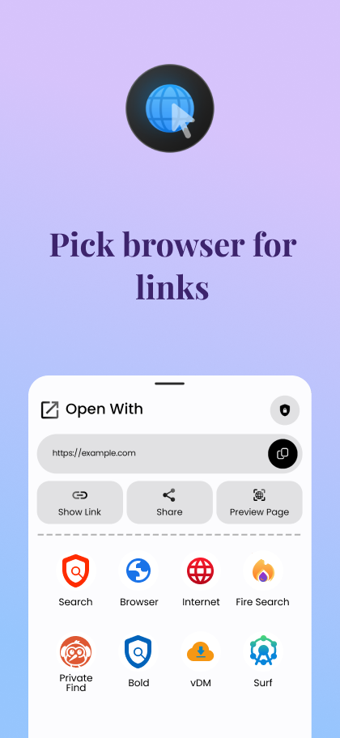
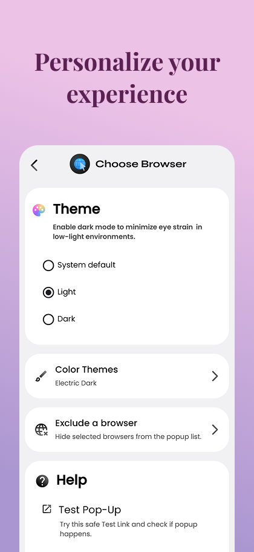
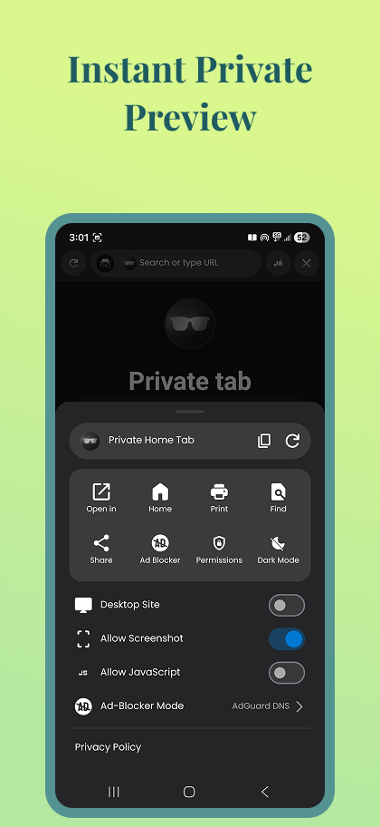

# Choose Browser

<p align="center">
  
</p>

<p align="center">
  <b>Instantly choose your preferred browser when tapping links on Android.</b>
</p>

Choose Browser acts as a lightweight system-wide browser router and link interceptor for Android. It bypasses Android 11's removal of the native "Ask Every Time" browser selection prompt by displaying a fast, customizable overlay picker whenever an HTTP/HTTPS link is opened or shared.

---

## # Screenshots

| Browser Overlay Popup | App Settings & Themes | In-App Web Preview |
| :---: | :---: | :---: |
|  |  |  |

<p align="center">
  <b><a href="scrn.md">View Full Screenshot & Feature Gallery (scrn.md)</a></b>
</p>

---

## # Index
- [Screenshots](#-screenshots)
- [Features](#-features)
- [How It Works](#-how-it-works)
- [Installation and Download](#-how-to-install)
- [Permissions](#-permissions)
- [Requirements](#-requirements)
- [How to Contribute](#-how-to-contribute)
- [License & Legal](#-license--legal)
- [Privacy Policy](#-privacy-policy)
- [Links & Contact](#-links)

---

## # Features
- **Instant Browser Overlay Picker:** Tap any link to see a lightweight sheet listing all installed web browsers.
- **Link Sanitization:** Automatically strips unwanted tracking parameters (e.g. `utm_*`, tracking tokens) before opening URLs.
- **6 Custom Color Themes:** Full light and dark mode support with color themes including Default, Vampire Ink, Electric Dark, Soft Espresso, and Amoled.
- **Browser Exclusion:** Easily hide specific browsers from appearing in the chooser popup.
- **Built-in Web Preview:** Fast preview WebView featuring temporary JavaScript toggles, CSS-injected dark mode, and AdGuard/Filter ad-blocking.
- **Launcher Shortcuts:** Quick shortcuts to access the Browser List or initiate a Private Search directly from your launcher.

---

## # How It Works
1. **Set as Default Browser:** Choose Browser registers as an intent handler for `http://` and `https://` schemes.
2. **Link Interception:** When a link is clicked in any app, Choose Browser intercepts the intent without opening a full application window.
3. **Clean & Route:** The URL is cleaned via `IntentUtils`, and the overlay dialog lists your available browsers to complete routing.

---

## # How to install

> **Download:** [Get the latest release here](https://github.com/SubhamSathua/choose-browser-android/releases)

1. **Download & Install:** Download the latest APK from the releases page and install it on your Android device.
2. **Set Default Browser:** Open Choose Browser and tap **"Set as Default Browser"**. Select Choose Browser in the system dialog.
3. **Grant Overlay Permission:** Enable **"Display over other apps"** permission to allow the overlay picker to render seamlessly over other applications.

---

## # Permissions

| Permission | Rationale |
| --- | --- |
| `DEFAULT_BROWSER` | Allows the app to intercept system-wide link intents (`http`/`https`). |
| `SYSTEM_ALERT_WINDOW` | Enables drawing the floating browser picker overlay over active apps. |
| `INTERNET` / `ACCESS_NETWORK_STATE` | Used by the optional in-app Web Preview feature. |
| `CAMERA` / `RECORD_AUDIO` / `LOCATION` | Supported inside the Web Preview page for sites requesting media/location access. |

---

## # Requirements
- **OS:** Android 7.0 (API Level 24) or higher.
- **Target OS:** Optimized for Android 11+ (API Level 30+).

---

## # How to contribute
Contributions, bug reports, and feature requests are welcome!

1. **Fork & Clone:** Clone the repository locally:
   ```bash
   git clone https://github.com/SubhamSathua/choose-browser-android.git
   ```
2. **Open in Android Studio:** Open the project in Android Studio (Jellyfish or newer recommended).
3. **Build & Verify:**
   ```bash
   ./gradlew clean assembleDebug
   ```

---

## # License & Legal
This project is licensed under the **Apache License 2.0**.

**Liability Protection:** The author provides this software "as is" without warranties of any kind. By using this software, you agree that the author is not liable for any damages, data loss, or system issues resulting from its use.

---

## # Privacy Policy
- **100% Local Processing:** All URL interception, browser querying, and link cleaning happen strictly on your local device.
- **Zero Cloud Servers:** No URLs, search queries, or browsing histories are uploaded to external servers.
- **Zero Tracking:** No telemetry, analytics, or background tracking services.

---

## # Links
- [Report an Issue](https://github.com/SubhamSathua/choose-browser-android/issues) - If you find a bug, please report it here.
- [Security Policy](SECURITY.md) - For reporting security vulnerabilities.
- [Feedback Form](https://tally.so/r/VLlZpM) - Quick feedback, big impact.
- [Apache 2.0 License](LICENSE)

---

## # Contact
**Author:** Subham Kumar Sathua  
**GitHub:** [@SubhamSathua](https://github.com/SubhamSathua)  
**Email:** [hyper.devstudio@protonmail.com](mailto:hyper.devstudio@protonmail.com)  

---

Copyright © 2026 Subham Kumar Sathua. Licensed under the Apache License 2.0.
