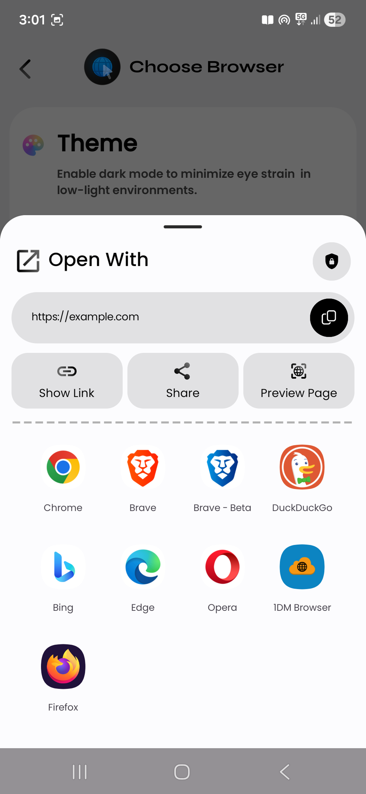
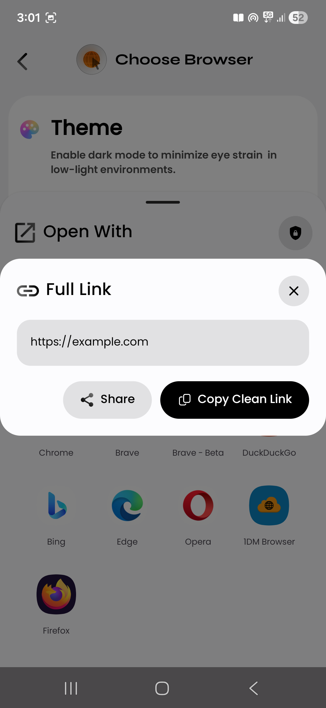
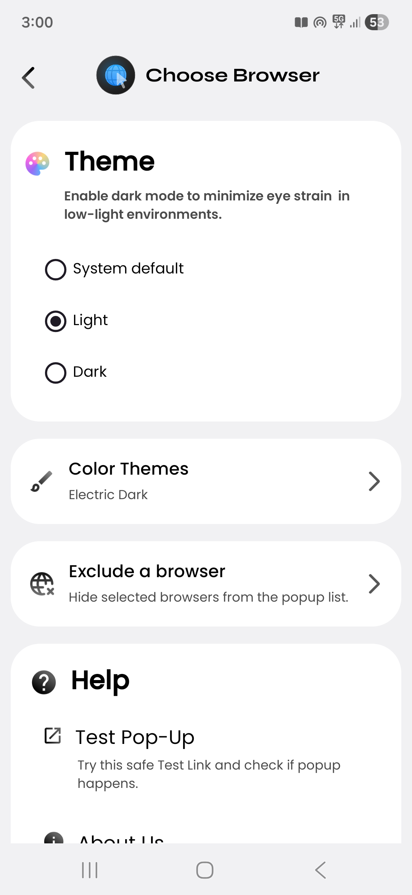
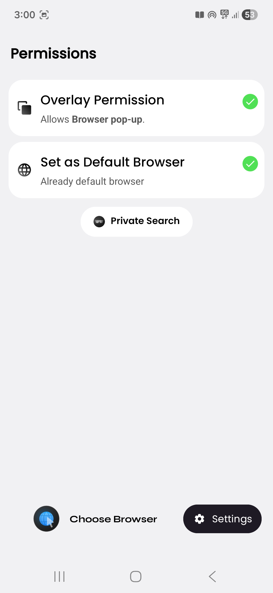
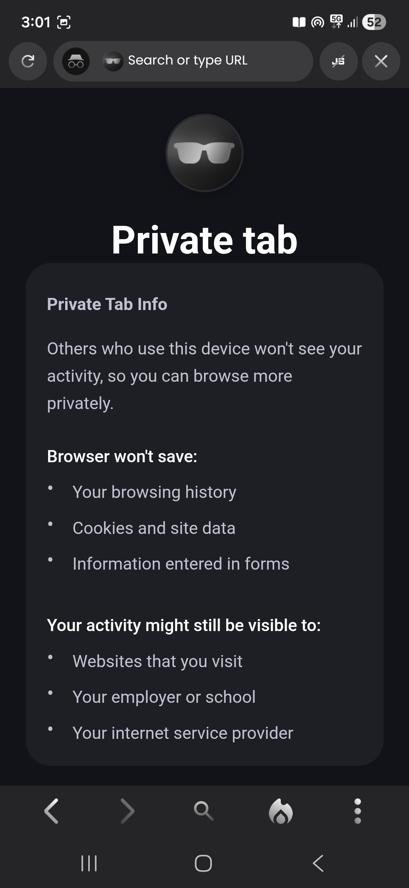
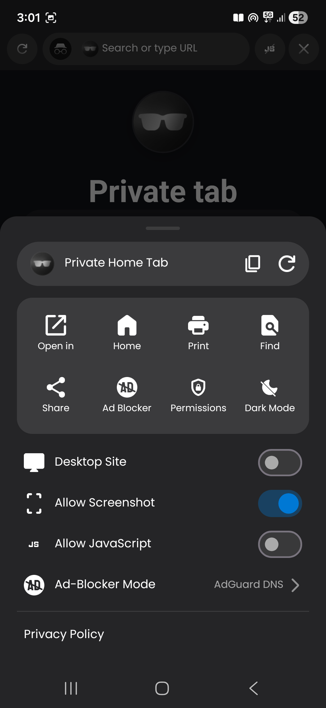

# Application Screenshots & Gallery

Welcome to the full screenshot gallery for **Choose Browser**.

---

## # Index
- [Browser Overlay & Link Interception](#-browser-overlay--link-interception)
- [Settings, Themes & Permissions](#-settings-themes--permissions)
- [In-App Web Preview](#-in-app-web-preview)

---

## # Browser Overlay & Link Interception

| Browser Overlay Popup | Browser Chooser Sheet | Show Link Details Sheet |
| :---: | :---: | :---: |
|  |  |  |

---

## # Settings, Themes & Permissions

| App Settings & Themes | Browser Management | Permissions Setup |
| :---: | :---: | :---: |
|  |  |  |

---

## # In-App Web Preview

| Web Preview Interface | Web Preview Home | Preview Options Menu Sheet |
| :---: | :---: | :---: |
|  |  |  |

---

⬅️ **[Back to Main README](../../README.md)**
